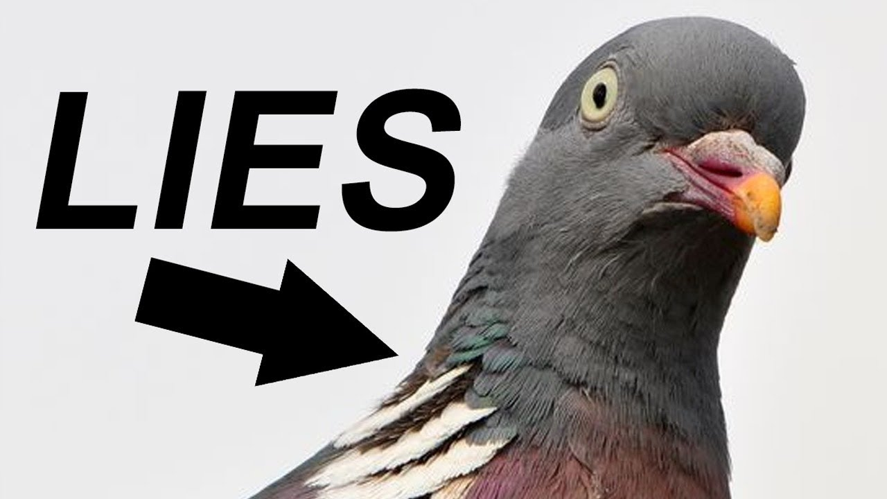

<h1> Have you ever seen a baby pigeon?</h1>
<a href="README.md">Home</a>
<h2>The birds work for the the bourgeoisie</h2>

In the 1960s, during Ronald Reagan's presidency, he had killed almost all birds within America. Those birds were then replaced with many robotic bird spies that now work with the bourgeoisie.

